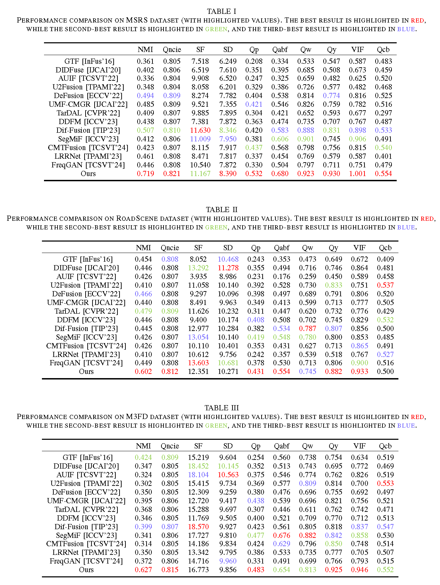

# MTFusion: A Dual-task-driven Mean Teacher Framework for Infrared and Visible Image Fusion

### Code
Codes will be released after the paper is accepted for publication.

### Add Quantitative comparison
Quantitative comparison of our MTFusion and 13 state-of-the-art methods on the MSRS, RoadScene and M3FD, respectively.

### Examples for comparison in our paper

#### Qualitative comparison.

#### Quantitative comparison.

